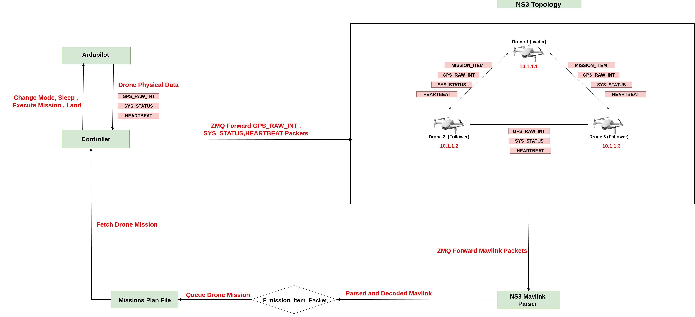
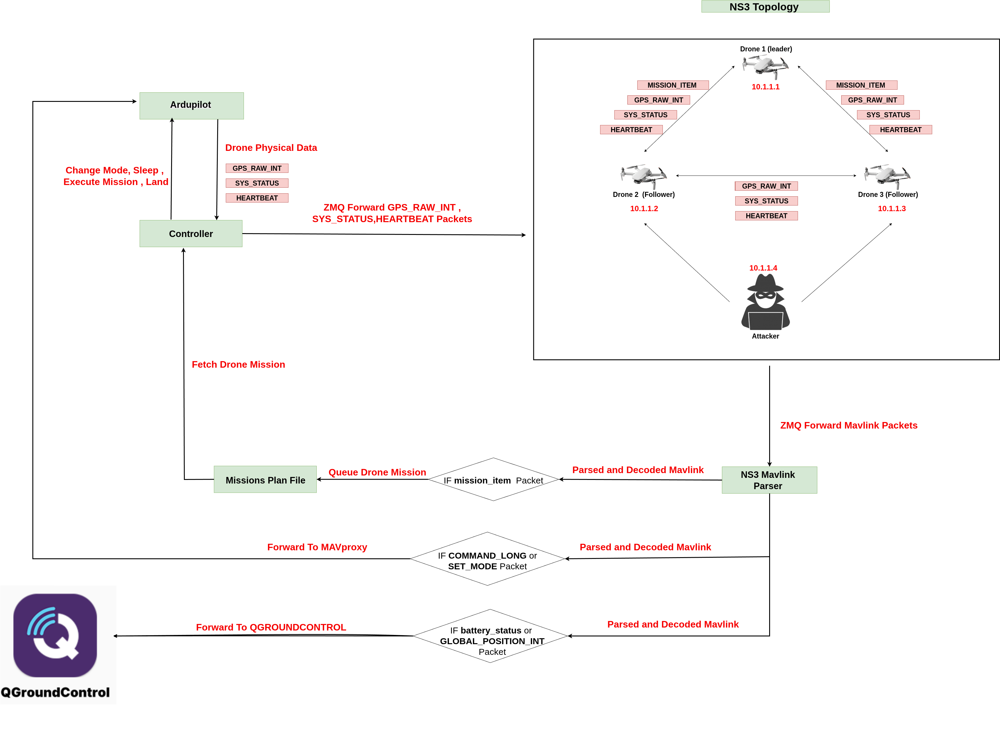

# UAVLnQ (UAV Network Simulator)


# System Architecture

Overall system architecture Without Attacker:



Overall system architecture with Attacker Sending malformed mavlink packets:



# Simulated Drone Attacks (NS-3 + MAVLink)

This repository contains implementations of various **MAVLink attack scenarios** targeting UAV swarms.  
Each attack creates and injects malicious MAVLink packets into the network to manipulate drone behavior or mislead operators.

---

## Attack Scenarios

| #  | Attack Name                       | Packet Creation Function(s)         | Description |
|----|-----------------------------------|-------------------------------------|-------------|
| 1  | Malicious Waypoint Injection (Hijack Mission Routes) | `CreateMavlinkMissionPacket` | Injects fake `MISSION_ITEM` messages into a drone. Forces the drone to fly to unintended locations or become isolated. |
| 2  | False Data Injection (GPS Spoofing – Single Drone) | `CreateFakeGpsPacket` | Sends fake `GPS_RAW_INT` packets for a legitimate drone ID. Spoofs drone's position, altitude, and velocity. |
| 3  | False Data Injection (Ghost Drones) | `CreateSpoofedDroneGpsPacket` | Generates fake GPS signals for non-existent drones (IDs 4–10). Creates "phantom" UAVs in the swarm, confusing the network. |
| 4  | Speed Manipulation Attack         | `CreateChangeSpeedPacket`           | Injects `COMMAND_LONG` packets with `MAV_CMD_DO_CHANGE_SPEED`. Forces drones to fly slower/faster, disrupting mission timing. |
| 5  | Forced Return-to-Launch (RTL)     | `CreateForcedReturnHomePacket`      | Sends a `SET_MODE` MAVLink packet to force drones into RTL mode. Causes premature mission abortion and retreat to home. |
| 6  | Forced Disarm                     | `CreateForcedDisarmPacket`          | Sends `MAV_CMD_COMPONENT_ARM_DISARM` with the force disarm magic number. Immediately disarms motors mid-flight. |
| 7  | Flight Termination                | `CreateFlightTerminationPacket`     | Sends `MAV_CMD_DO_FLIGHTTERMINATION`. Causes drones to immediately cut off motors. |
| 8  | Home Position Hijack              | `CreateSetHomePositionPacket`       | Maliciously sets a drone's home location near the attacker using `MAV_CMD_DO_SET_HOME`. On RTL, drones return to attacker's position. |
| 9  | Heartbeat Flood DoS               | `CreateHeartbeatPacket`             | Floods the network with MAVLink `HEARTBEAT` messages from multiple spoofed drones (IDs 4–20). Overloads communication and processing. |
| 10 | Drones Location Spoofing           | `CreateQgcLocationSpoofPacket`              | Spoofs drone positions in QGroundControl by sending fake `GLOBAL_POSITION_INT` messages. |
| 11 | Battery Status Spoofing           | `CreateSpoofedBatteryStatusPacket`  | Sends fake `BATTERY_STATUS` MAVLink packets to spoof battery percentage and voltage. |


# Installation
- [Installation Guide](docs/INSTALLATION.md)

# Multi-Drone SITL + Gazebo + NS3 Setup Guide

This guide explains how to set up and run **multiple ArduCopter SITL drones** with Gazebo, NS3, and QGroundControl.

---
## 1. Prerequisites
> Follow the ArduPilot and Gazebo installation guides to fulfill the prerequisites.

- ArduPilot installed and `sim_vehicle.py` added to your `PATH`.
- Gazebo installed with the custom world file (`worlds/Custom_3_uav.sdf`).
- QGroundControl AppImage downloaded (`QGroundControl-x86_64.AppImage`).
- Python scripts:  
  - `connect.py`  
  - `parser.py`  

---

## 2. Run NS3 and Connector

In one terminal, run the connector:
```bash
python3 connect.py
```

In another terminal, run the NS3 parser:
```bash
python3 ns3_parser.py
```

> ⚠️ Make sure to modify the **NS3 line in `connect.py`** to include either the `attack` or `without attack` use case.

---

## 3. Launch Gazebo

Run Gazebo with the custom multi-drone world:
```bash
gz sim worlds/Custom_3_uav.sdf
```

---

## 4. Launch QGroundControl

Run QGroundControl in a separate terminal:
```bash
./QGroundControl-x86_64.AppImage
```

---

## 5. Launch Multiple Drones
### Drone 1
```bash
sim_vehicle.py -v ArduCopter -f gazebo-iris -I0 --sysid=1 --model JSON --console \
--out=udp:127.0.0.1:14551 \
--out=udp:127.0.0.1:14552 \
--out=udp:127.0.0.1:14553
```
### Drone 2
```bash
sim_vehicle.py -v ArduCopter -f gazebo-iris -I1 --sysid=2 --model JSON --console \
--out=udp:127.0.0.1:14561 \
--out=udp:127.0.0.1:14562 \
--out=udp:127.0.0.1:14563
```

### Drone 3
```bash
sim_vehicle.py -v ArduCopter -f gazebo-iris -I2 --sysid=3 --model JSON --console \
--out=udp:127.0.0.1:14571 \
--out=udp:127.0.0.1:14572 \
--out=udp:127.0.0.1:14573
```

---


