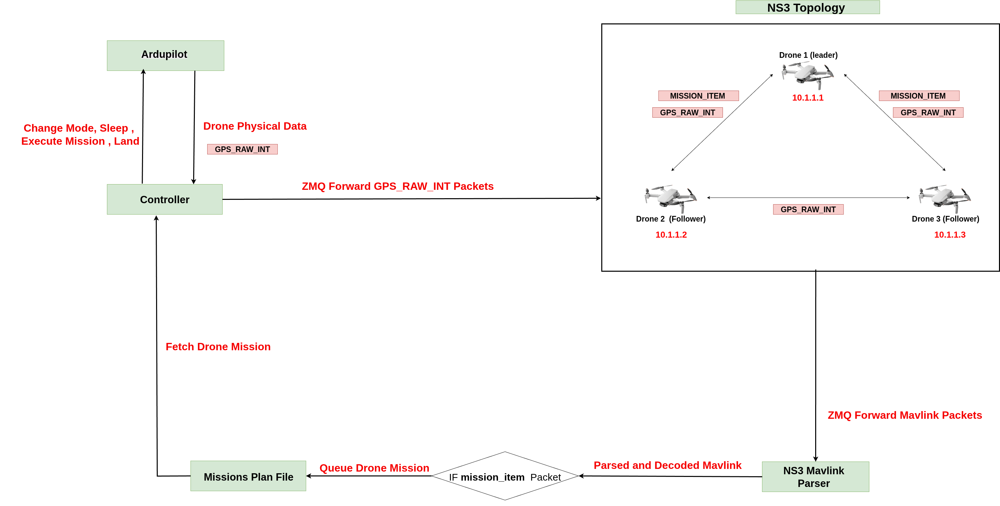

# System Architecture

Overall system architecture Without Attacker:



Overall system architecture with Attacker Sending malformed mavlink packets:


# Simulated Drone Attacks (NS-3 + MAVLink)

| # | Attack Name                        | Function                          | Description |
|---|------------------------------------|-----------------------------------|-------------|
| 1 | **Malicious Waypoint Injection** <br> (Hijack Mission Routes) | `CreateMavlinkMissionPacket` | Injects fake `MISSION_ITEM` messages into a drone. Forces the drone to fly to unintended locations or become isolated. |
| 2 | **False Data Injection** <br> (GPS Spoofing – Single Drone) | `CreateFakeGpsPacket` | Sends fake `GPS_RAW_INT` packets for a legitimate drone ID. Spoofs drone’s position, altitude, and velocity. |
| 3 | **False Data Injection** <br> (Ghost Drones) | `CreateSpoofedDroneGpsPacket` | Generates fake GPS signals for **non-existent drones** (IDs 4–10). Creates “phantom” UAVs in the swarm, confusing the network. |
| 4 | **Speed Manipulation Attack** | `CreateChangeSpeedPacket` | Injects `COMMAND_LONG` packets with `MAV_CMD_DO_CHANGE_SPEED`. Forces drones to fly slower/faster, disrupting mission timing. |
| 5 | **Forced Return-to-Launch (RTL)** | `CreateForcedReturnHomePacket` | Sends a `SET_MODE` MAVLink packet to force drones into **RTL mode**. Causes premature mission abortion and retreat to home. |
| 6 | **Forced Disarm** | `CreateForcedDisarmPacket` | Sends `MAV_CMD_COMPONENT_ARM_DISARM` with the *force disarm magic number*. Immediately disarms motors mid-flight. |
| 7 | **Flight Termination** | `CreateFlightTerminationPacket` | Sends `MAV_CMD_DO_FLIGHTTERMINATION`. Causes drones to immediately cut off motors. |
| 8 | **Home Position Hijack** | `CreateSetHomePositionPacket` | Maliciously sets a drone’s **home location** near the attacker. On RTL, drones return to attacker’s position. |

# Installation

# Setup
### Drone 1
```bash
./sim_vehicle.py -v ArduCopter -f gazebo-iris -I0 --sysid=1 --model JSON --console \
--out=udp:127.0.0.1:14551 \
--out=udp:127.0.0.1:14552 \
--out=udp:127.0.0.1:14553
```
### Drone 2
```bash
./sim_vehicle.py -v ArduCopter -f gazebo-iris -I1 --sysid=2 --model JSON --console \
--out=udp:127.0.0.1:14561 \
--out=udp:127.0.0.1:14562 \
--out=udp:127.0.0.1:14563
```

### Drone 3
```bash
./sim_vehicle.py -v ArduCopter -f gazebo-iris -I2 --sysid=3 --model JSON --console \
--out=udp:127.0.0.1:14571 \
--out=udp:127.0.0.1:14572 \
--out=udp:127.0.0.1:14573
```


