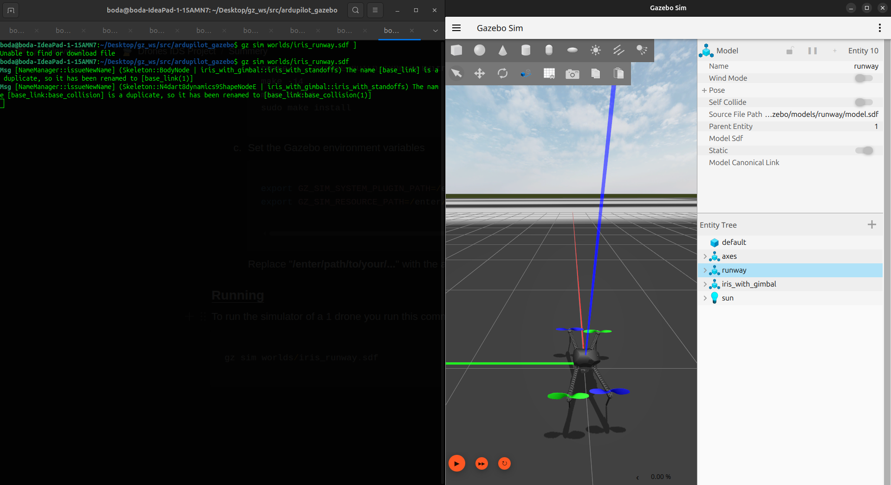
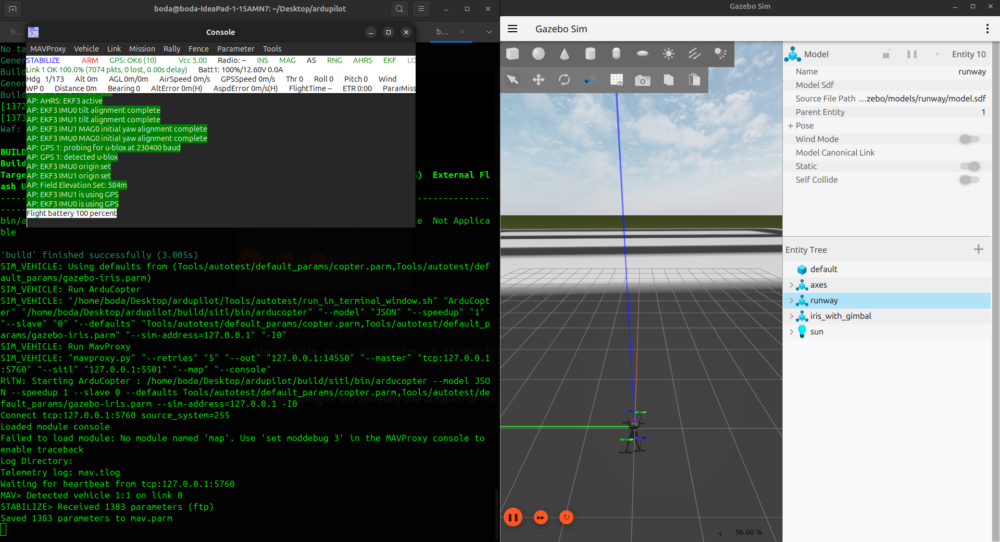
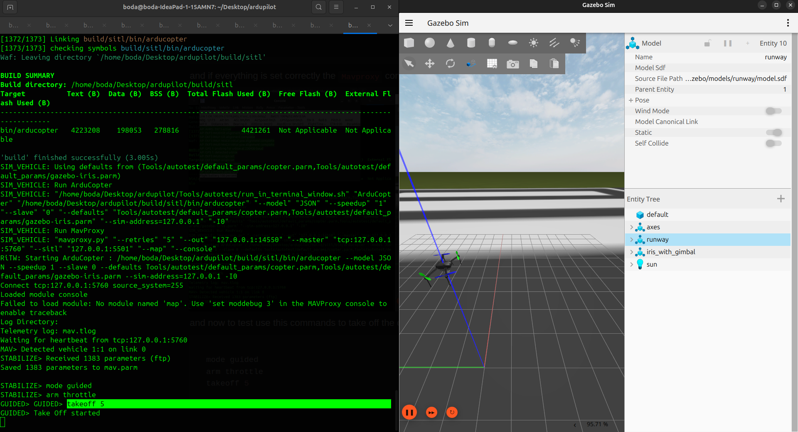
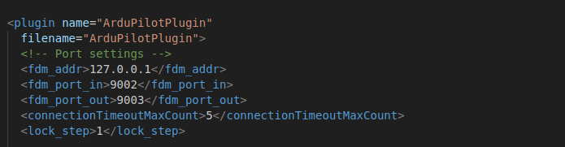
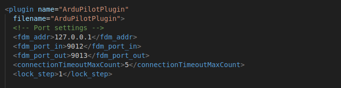
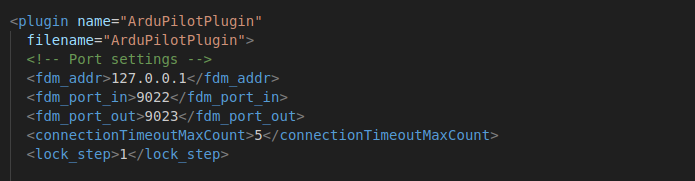
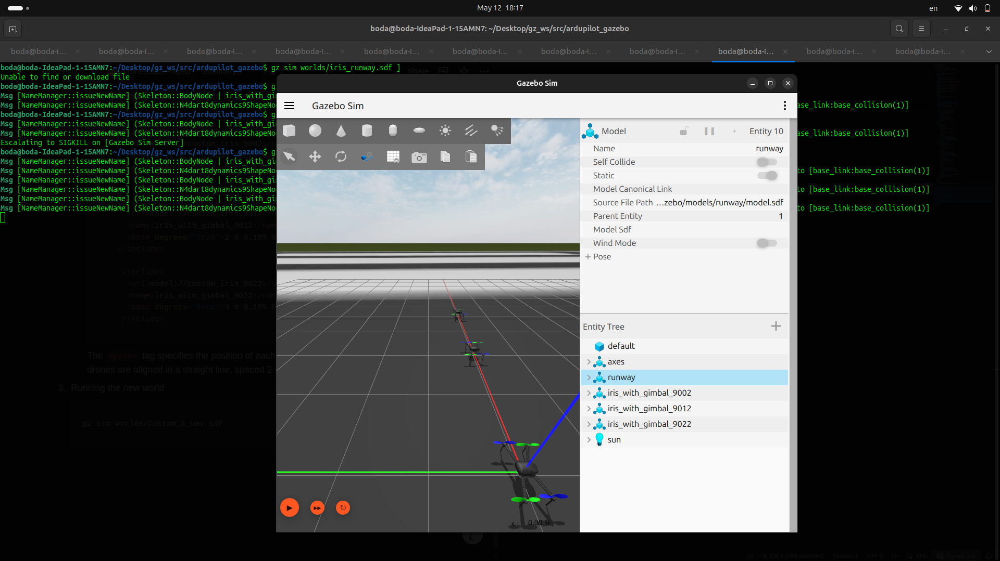

# Gazebo Simulation Setup and Use Cases Guide

## 1. Running Gazebo

Gazebo can be used to simulate a single drone with ArduPilot. Follow these steps to run the simulation.

### Running a Single UAV

Run the following command to start Gazebo with the default `iris_runway.sdf` world:

```bash
gz sim worlds/iris_runway.sdf
```

This will launch the simulator.  
Click the **Run** button to start the simulation:




Now, connect ArduPilot to the simulator with:

```bash
sim_vehicle.py -v ArduCopter -f gazebo-iris --model JSON --map --console
```

If everything is set correctly, the `MAVProxy` console will display green status messages:



You can then issue the following commands in `MAVProxy` to take off:

```bash
mode guided
arm throttle
takeoff 5
```



---

## 2. A Multi-World for Gazebo

By default, the `iris_runway.sdf` world supports a single UAV. To simulate **multiple UAVs**, you will need to create a custom world. Below are the steps.

### Step 1: Duplicate and Modify UAV Models

Navigate to the models folder and create copies of the `iris_with_gimbal` model:

```bash
cd /ardupilot_gazebo/models

cp iris_with_gimbal -r custom_iris_9002
cp iris_with_gimbal -r custom_iris_9012
cp iris_with_gimbal -r custom_iris_9022
```

Edit each model’s `model.sdf` file and update the ports:

```xml
<!-- custom_iris_9002 -->
<fdm_port_in>9002</fdm_port_in>
<fdm_port_out>9003</fdm_port_out>

<!-- custom_iris_9012 -->
<fdm_port_in>9012</fdm_port_in>
<fdm_port_out>9013</fdm_port_out>

<!-- custom_iris_9022 -->
<fdm_port_in>9022</fdm_port_in>
<fdm_port_out>9023</fdm_port_out>
```

  
  


Each new SITL instance uses ports spaced by 10 units.  
For example: `9002/9003`, `9012/9013`, `9022/9023`, etc.

---

### Step 2: Create a Custom World

Navigate to the worlds folder and copy the default world:

```bash
cd /ardupilot_gazebo/worlds
cp iris_runway.sdf Custom_3_uav.sdf
```

Edit `Custom_3_uav.sdf`:

- Remove the default `iris_with_gimbal` model:

```xml
<include>
  <uri>model://iris_with_gimbal</uri>
  <pose degrees="true">0 0 0.195 0 0 90</pose>
</include>
```

- Add your custom UAV models:

```xml
<include>
  <uri>model://custom_iris_9002</uri>
  <name>iris_with_gimbal_9002</name>
  <pose degrees="true">0 0 0.195 0 0 90</pose>
</include>

<include>
  <uri>model://custom_iris_9012</uri>
  <name>iris_with_gimbal_9012</name>
  <pose degrees="true">2 0 0.195 0 0 90</pose>
</include>

<include>
  <uri>model://custom_iris_9022</uri>
  <name>iris_with_gimbal_9022</name>
  <pose degrees="true">4 0 0.195 0 0 90</pose>
</include>
```

This places drones in a straight line, spaced 2 meters apart.

---

### Step 3: Run the Custom World

```bash
gz sim worlds/Custom_3_uav.sdf
```



---

### Step 4: Connect Multiple Drones to ArduPilot

Use separate terminals for each drone instance:

```bash
# Terminal 1
sim_vehicle.py -v ArduCopter -f gazebo-iris --model JSON --map --console -I0

# Terminal 2
sim_vehicle.py -v ArduCopter -f gazebo-iris --model JSON --map --console -I1

# Terminal 3
sim_vehicle.py -v ArduCopter -f gazebo-iris --model JSON --map --console -I2
```

You can now control three UAVs simultaneously within Gazebo.
